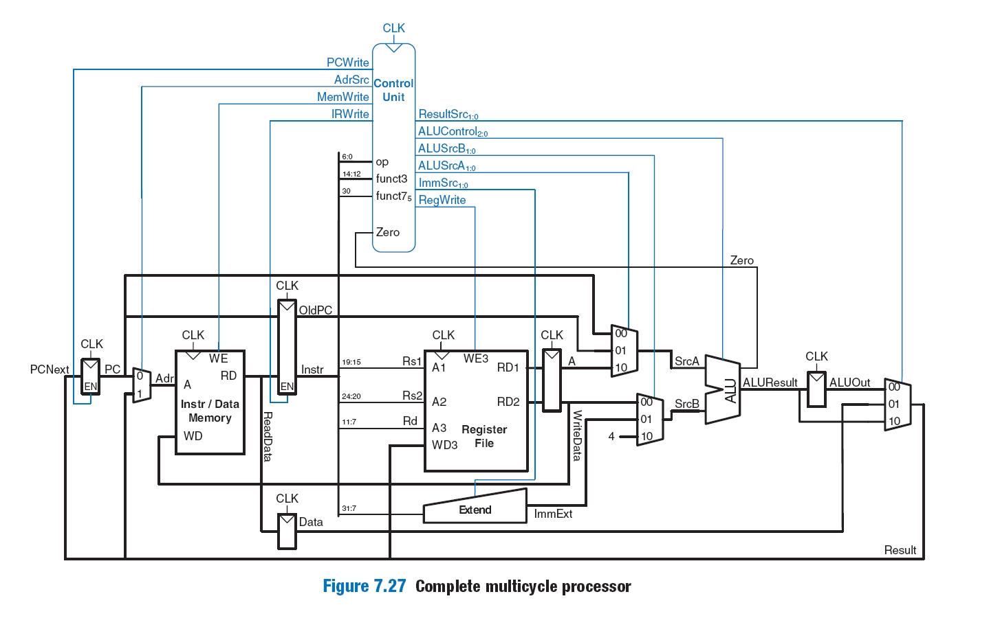

# RISC-V Multicycle Processor

This project implements a multicycle RISC-V processor based on the **RV32I** instruction set. It was developed as part of the **MO801** course at the **University of Campinas**, under Prof. **Rodolfo Jardim**. The processor is intended as an educational tool to explore foundational topics in computer architecture, including datapath design, control logic, instruction decoding, and finite state machines.

Each instruction executes over multiple clock cycles depending on its type and required resources.

**Name:** Andreis Purim (213095)

**Note:** Code comments and documentation were enhanced using GitHub Copilot and GPT to improve readability, modularity, and maintainability.

---

## ✔️ Instructions Implemented

The processor supports the **RV32I** base instruction set, as defined in the official [RISC-V ISA Manual (RV32I)](https://msyksphinz-self.github.io/riscv-isadoc/html/rvi.html):

- **R-type:** `ADD`, `SUB`, `SLL`, `SLT`, `SLTU`, `XOR`, `SRL`, `SRA`, `OR`, `AND`  
- **I-type:** `ADDI`, `SLLI`, `SLTI`, `SLTIU`, `XORI`, `SRLI`, `SRAI`, `ORI`, `ANDI`  
- **B-type / Control:** `BEQ`, `BNE`, `BLT`, `BGE`, `BLTU`, `BGEU`, `JAL`, `JALR`  
- **S-type / Loads and Stores:** `LB`, `LH`, `LW`, `LBU`, `LHU`, `SB`, `SH`, `SW`  
- **U-type:** `LUI`, `AUIPC`  

> WARNING: These instructions are implemented in hardware, though not all have been fully tested yet.

---

## 🧪 Running the Project

1. **Install Icarus Verilog**  
   Use `./setup.sh` or your system’s package manager (e.g., `apt`, `brew`) to install it.

2. **Run Tests**  
   Run `./run-all.sh` to compile and simulate all test cases in the `/test` directory.

### Writing Your Own Tests

- Create a `.mem` file (e.g., `teste01.mem`) containing the instruction/data memory image.
- Add a corresponding `.ok` file (e.g., `saida01.ok`) with the expected output.
- The test runner will compile and compare the simulation output automatically.

To assemble RISC-V code into `.mem` format, you can use:

- [riscv-gnu-toolchain](https://github.com/riscv-collab/riscv-gnu-toolchain) (full toolchain)
- [riscvasm.lucasteske.dev](https://riscvasm.lucasteske.dev) (minimal web-based assembler – used in this project)

---

## 🧠 Understanding the Simulation

Refer to `tb.v` (testbench) to understand the simulation flow:

- The simulation resets at the beginning.
- It terminates on any of the following:
  - 4000 time units (2000 clock cycles)
  - Execution of the `ebreak` instruction
  - Access to memory address `0xFFC` (4092)
- Any memory access where `address[11] == 1` is printed to the console.

---

## 📚 References

### Documentation

- [RISC-V Instruction Set Manual (RV32I)](https://msyksphinz-self.github.io/riscv-isadoc/html/rvi.html)  
  The official and complete specification for RV32I instructions.

- [Computer Organization and Design](https://ia601209.us.archive.org/24/items/ComputerOrganizationAndDesign3rdEdition/-computer%20organization%20and%20design%203rd%20edition.pdf)  
  Patterson & Hennessy. A classic reference on multicycle processor design.

### Reference Implementations

- [Amirarsalan-sn/RISCV-multi-cycle-processor](https://github.com/Amirarsalan-sn/RISCV-multi-cycle-processor)  
  Modular SystemVerilog-based multicycle processor.

- [parhamsoltani/Multicycle_RISCV](https://github.com/parhamsoltani/Multicycle_RISCV)  
  Verilog-based processor with microcoded control and detailed FSM logic.

---

## 🔧 TODO & Improvements

- Improve `run.sh` and `run-all.sh` to produce clearer error messages.
- Refactor `memstage.v` and `memory.v` for better modular separation.
- Expand test coverage for, especially for conditionals, misaligned loads/stores and edge cases (overflow?)
- Add full instruction test coverage with automated trace validation.

---

